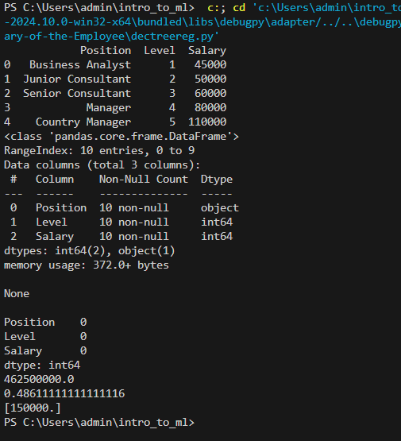

# Implementation-of-Decision-Tree-Regressor-Model-for-Predicting-the-Salary-of-the-Employee

## AIM:
To write a program to implement the Decision Tree Regressor Model for Predicting the Salary of the Employee.

## Equipments Required:
1. Hardware – PCs
2. Anaconda – Python 3.7 Installation / Jupyter notebook

## Algorithm
1. Import the necessary packages
2. Load the dataset and prepare the features to load it into the model
3. Build the model
4. Predict results and evaluate performance metrics

## Program:
```
/*
Program to implement the Decision Tree Regressor Model for Predicting the Salary of the Employee.
Developed by: Shri Sai Aravind R
RegisterNumber:  212223040197
*/
```
```py
import pandas as pd
from sklearn.preprocessing import LabelEncoder
from sklearn.model_selection import train_test_split
from sklearn.tree import DecisionTreeRegressor
from sklearn.metrics import mean_squared_error, r2_score

data=pd.read_csv("Salary.csv")
print(data.head())
print(f"\n{data.info()}")
print(f"\n{data.isnull().sum()}")


le=LabelEncoder()
data["Position"]=le.fit_transform(data["Position"])
data.head()

x=data[["Position","Level"]]
y=data["Salary"]

x_train,x_test,y_train,y_test=train_test_split(x,y,test_size=0.2,random_state=2)


dt=DecisionTreeRegressor().fit(x_train.values,y_train.values)
y_pred=dt.predict(x_test.values)


mse=mean_squared_error(y_test,y_pred)
print(mse)

r2=r2_score(y_test,y_pred)
print(r2)

print(dt.predict([[5,6]]))
```

## Output:



## Result:
Thus the program to implement the Decision Tree Regressor Model for Predicting the Salary of the Employee is written and verified using python programming.
